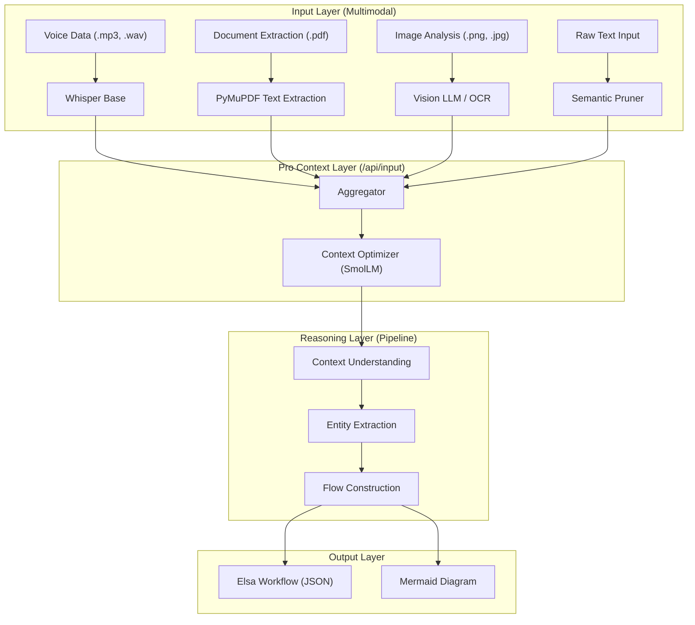

# System Architecture and AI Design System

The Flou2Flow architecture is engineered for distributed AI reasoning across specialized, low parameter models.

## Multimodal Pipeline Architecture

The following diagram illustrates the information flow from raw multimodal ingestion to structured workflow generation.

## AI Design System

The Flou2Flow AI Design System is built on the principle of heterogeneous model orchestration. Instead of a monolithic approach, we utilize a specialized matrix of lightweight models to achieve high performance on edge hardware.

### Model Matrix

| Engine | Core Model | Primary Responsibility | Optimization Strategy |
| :--- | :--- | :--- | :--- |
| Cleaning Engine | SmolLM 135M | Semantic noise removal and text distillation | Maximum token density |
| Analytical Engine | Qwen2 0.5B / 1.5B | Entity extraction and logical mapping | Grammar constrained JSON |
| Vision Engine | Llava / Moondream | Diagram analysis and OCR extraction | Spatial process reconstruction |
| Transcription Engine | Whisper Base | Audio to text conversion | Local CPU bound inference |

### Core Design Principles

1. Task Atomicity: Every AI task is broken down into its smallest logical component to allow for targeted model selection.
2. Contextual Isolation: Only the minimum required context is passed to the AI engines, managed via stable content hashing.
3. Structural Enforcement: We rely on mathematical grammar constraints rather than complex prompting to ensure data integrity.

### System Workflow Lifecycle

The coordination between these engines follows a linear optimization path:

1. Ingestion: Raw data is captured and routed to the appropriate specialized extraction engine based on file type.
2. Distillation: The Cleaning Engine removes noise and produces a high density semantic summary.
3. Decomposition: The Analytical Engine breaks the summary into discrete entities such as Actors and Tasks.
4. Structuring: The system converts the entities into TOON format to minimize token load during the final logic phase.
5. Synthesis: The Final Pipeline constructs the logical connections and exports the result as an Elsa compatible workflow.
