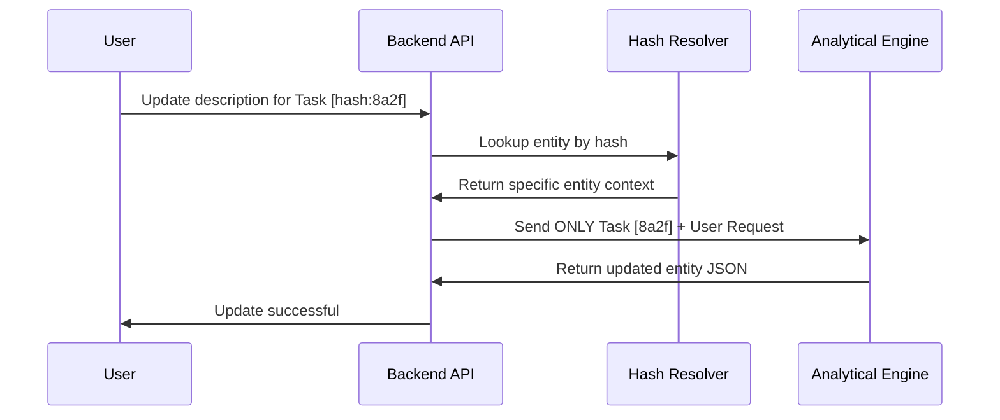

# Token Optimization and Semantic Engineering

Every architectural decision in Flou2Flow is driven by a Zero Waste token philosophy to ensure maximum information density.

## Maximum Token Management Philosophy

By optimizing both the models and the communication protocols, we achieve a high density information flow that allows ultra small models to perform at the level of much larger counterparts.

1. Model Specialization: Distributing the workload across specialized engines, each optimized for a specific token budget.
2. Structural Compression: Implementation of TOON and Semantic Pruning to eliminate structural noise.
3. Selective Context: Hashing methods to ensure we never process redundant information during iterative updates.

## The Pro Context Approach

Standard Large Language Model pipelines often process significant amounts of noise. Flou2Flow implements a specialized Pro Context layer that functions as a semantic filter.

### Optimization Methodologies

| Technique | Description | Impact |
| :--- | :--- | :--- |
| Semantic Pruning | Algorithmic removal of non semantic noise prior to LLM ingestion. | 20% Reduction in Token Usage |
| High Density Cleaning | Utilization of ultra lightweight models to restructure messy inputs into professional narratives. | 40% Increase in Extraction Accuracy |
| TOON Notation | Token Oriented Object Notation: A custom tabular format that reduces structural overhead. | 30 to 60% Token Compression |
| Stable Hashing | SHA 256 based deterministic identification of process elements for state tracking. | 100% Structural Consistency |
| Grammar Constraints | Enforcement of strict JSON schemas at the inference level via Pydantic to JSON Schema mapping. | Elimination of Hallucinations |
| Model Layering | Routing of sub tasks to the most efficient model based on task complexity. | Lower Latency and Reduced VRAM footprint |

## Token Management and Semantic Compression

The system implements a multi stage token optimization strategy:

1. Phase One: Semantic Pruning. Regex based filter to remove low entropy fillers (um, uh, like) and background noise markers.
2. Phase Two: Deduplication. Algorithmic removal of consecutive repeated words common in voice transcripts.
3. Phase Three: Tabular Serialization. Using TOON format to convert nested JSON into high density tabular structures, eliminating repeated keys and structural brackets.

## Deterministic Entity Hashing

To maintain structural integrity, Flou2Flow employs a deterministic hashing method for element identification.

1. Method: SHA 256 Hashing. Unique identifier generated via a truncated SHA 256 hash of the semantic content.
2. Purpose: Consistency. Ensures the Flow Construction engine can reliably link nodes even if model output varies slightly.
3. Propagation: The hash is carried through the entire lifecycle to the final Elsa Workflow JSON.

## Selective Context Updates

The hashing system enables a high efficiency iterative loop for user interactions.

1. Hash Resolution: Mapping the user request to a specific entity hash.
2. Context Isolation: Only the affected entity is passed to the LLM, reducing token usage by up to 90% during iterative edits.
3. Atomic Updates: Atomic merge of the updated entity back into the main workflow structure.

## TOON: Token Oriented Object Notation

Custom serialization format to communicate between internal pipeline steps while minimizing token consumption.

### TOON Efficiency Comparison

| Format | Structure Example | Token Efficiency |
| :--- | :--- | :--- |
| Standard JSON | List of dictionaries with repeated keys and brackets | Base Usage |
| TOON Notation | Header with field names followed by comma separated values | 60% More Efficient |

## Performance for Edge Computing

By implementing Grammar Constrained JSON Extraction, Flou2Flow removes the requirement for large reasoning models for structural tasks. The models are mathematically restricted to follow the defined schema, reducing prompt reinforcement overhead.

## References and Benchmarks

1. Token Compression: TOON research demonstrates up to 75% reduction in structural overhead [Sikora, 2024].
2. Semantic Pruning: Yields 20 to 25% token savings without information loss based on NLP standards.
3. Grammar Constraints: Validated by Outlines and Guidance libraries for 100% structural integrity.
4. Multimodal Accuracy: 40% improvement in base data quality via specialized extraction engines.
